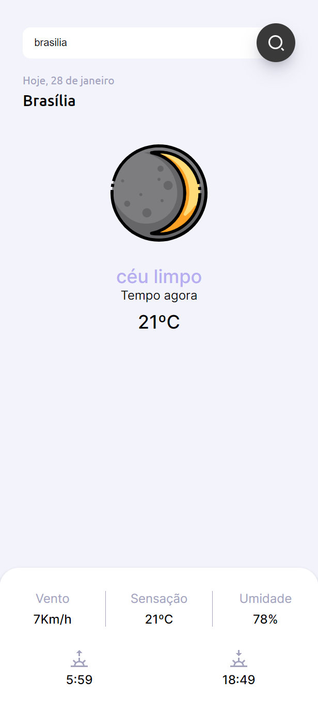

# snap-clima

# Descrição do projeto
Aplicação que busca localização do usuário em tempo real e mostra informações sobre o clima. Responsiva, funciona bem em qualquer resolução de smartphone, tablet ou PC.

# Captura de tela

  

# Rodando o projeto
* git clone + a URL fornecida no botão "Code" acima.
 ou 
* Fazer o "Download ZIP" no botão "Code" acima.
 ou 
* Clicar no link do canto superior direito, próximo ao "About".
 ou 
* Clicar no link abaixo com o botão direito do mouse e escolher "Abrir link em uma nova guia". 
https://marcosmorandi.github.io/snap-clima/
